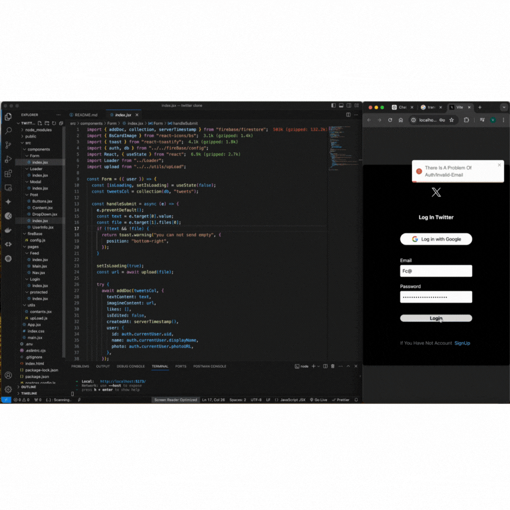

### 🚀 Yeni Proje: Twitter Clone 🐦

- Twitter klonu üzerinde çalıştım ve sonunda tamamladım. Bu projede birkaç modern web geliştirme teknolojisi ve kütüphane kullandım. İşte detaylar:

####✨ Kullanılan Teknolojiler:

- ⚛️ React: Kullanıcı arayüzünü oluşturmak için.

- 🛣️ React Router DOM: Sayfa yönlendirmeleri ve kullanıcı dostu gezinme için.

- 🍞 React Toastify: Kullanıcı bildirimleri için.

- 📅 Moment.js: Tarih ve saat işlemleri için.

- 🆔 UUID: Benzersiz kimlikler oluşturmak için.

- 🔥 Firebase: Veritabanı ve kullanıcı kimlik doğrulama işlemleri için.

- 🎨 Tailwind CSS: Stil ve tasarım için.

- 🌟 React Icons: Projeye ikonlar eklemek için.

####🔧 Özellikler:

- 📄 Tweet oluşturma, düzenleme ve silme

- 🖼️ Resim yükleme

- 📅 Tweet zamanını gösterme

- 🔐 Kullanıcı kimlik doğrulama

Projeyi incelemeniz ve geri bildirimlerinizi paylaşmak için sabırsızlanıyorum! 🎉

#React #JavaScript #WebDevelopment #Frontend #Firebase #CSS #Programming #LinkedIn #Tech #Developer

